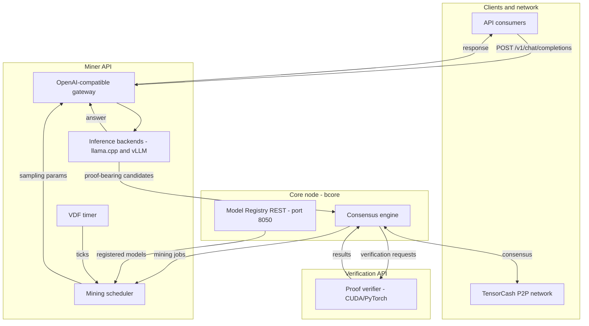

<div align="center">

# TensorCash

**Useful proof-of-work for verifiable AI.**

TensorCash is a Bitcoin-derived layer-1 where AI inference becomes mining work:
an operator running a registered open-source model attaches a proof transcript to
the answer, and qualifying proof-bearing answers can extend the chain. One model
run can serve a user and secure a public ledger.

[Website](https://tensorcash.org) | [What is TensorCash?](https://tensorcash.org/what-is-tensorcash/) | [Whitepapers](https://tensorcash.org/whitepapers/) | [Docs](https://tensorcash.org/docs/) | [JSON-RPC reference](https://tensorcash.org/docs/rpc/)

</div>

---

This is the **umbrella repository**. It pins and wires together the TensorCash
consensus node, mining and verification services, cryptographic utilities, and
deployment topologies. The main components also live in their own repositories
and are consumed here as submodules.

## Why TensorCash

TensorCash connects two systems that are usually treated separately.

**01 - Decentralised AI compute.** AI users and aggregators should not have to
trust a provider's word about which model ran. TensorCash lets an inference
provider attach a proof-of-inference transcript to a model run. Verifiers can
check that transcript against the public model and declared sampling conditions.
Because production inference is not bit-for-bit reproducible across GPUs,
kernels, batching regimes, and floating-point formats, verification is a tiered
statistical check rather than a naive byte-for-byte replay.

**02 - Decentralised finance.** TensorCash uses that same proof primitive as
proof of work. Miners run useful inference on registered open-source models,
bind the transcript to recent chain state, and compete to produce blocks. The
ledger stays deliberately conservative: a Bitcoin-style UTXO base with native
assets, ZK/KYC compliance proofs, bounded settlement contracts, legal-document
anchoring, and post-quantum spending paths, without adding a general-purpose VM.

The longer narrative is on [tensorcash.org](https://tensorcash.org), especially
[What is TensorCash?](https://tensorcash.org/what-is-tensorcash/) and the
[whitepapers](https://tensorcash.org/whitepapers/).

## How it works



1. **Miner API** exposes an OpenAI-compatible endpoint and routes requests to a
   registered model served by `llama.cpp` or vLLM. The proof evidence is captured
   inside the sampling path rather than by running a second workload.
2. **Core node (`bcore`)** is the consensus engine. It schedules mining jobs,
   accepts proof-bearing block candidates, enforces model-aware difficulty, and
   exposes the small Model Registry REST surface used by miners.
3. **Verification API** independently checks proof transcripts. The verifier is
   open source so operators can audit, reproduce, and challenge bad proofs.

The services use JSON-RPC, REST, ZMQ, and FlatBuffers. The machine contracts on
the website are the authoritative public API surface: `openrpc.json`,
`openapi/*.json`, and the FlatBuffer schemas.

## Repository layout

```text
.
├── services/
│   ├── core-node/        # bcore submodule: consensus node and Model Registry REST
│   ├── miner-api/        # OpenAI-compatible miner service plus inference backends
│   └── verification-api/ # GPU proof verifier
├── shared-utils/         # chiavdf, pow-utils, fb-schemas, kyc-prover, liboqs, secp256k1-zkp
├── deployments/          # docker-compose, kubernetes, desktop app, simple workers
├── documentation/        # service docs, asset RPC process, wallet assets
├── tips/                 # TensorCash Improvement Proposals
├── packaging/            # desktop and release packaging helpers
├── scripts/              # build, test, replay, and schema helpers
└── website/              # tensorcash.org source submodule
```

## Component repositories

| Repository | Role |
| --- | --- |
| [`tensorcash/tensorcash`](https://github.com/tensorcash/tensorcash) | Umbrella repository: pins submodules, docs, deployments, CI, and public governance files. |
| [`tensorcash/bcore`](https://github.com/tensorcash/bcore) | Bitcoin-Core-derived consensus node with proof-of-inference PoW, VDF timing, model registry, native TLV assets, ZK/KYC enforcement, settlement opcodes, and ML-DSA spending. |
| [`tensorcash/vllm`](https://github.com/tensorcash/vllm) | vLLM fork carrying the proof-of-inference sampler path on branches `feature/pow-on-v0.10`, `feature/pow-on-v0.16`, and `feature/pow-on-v0.19`. |
| [`tensorcash/llama.cpp`](https://github.com/tensorcash/llama.cpp) | llama.cpp fork with proof-of-work/proof transcript passthrough for local and single-worker inference paths. |
| [`tensorcash/vllm-production-stack`](https://github.com/tensorcash/vllm-production-stack) | Reference Kubernetes stack for scaling vLLM-backed mining workers. |
| [`tensorcash/gnark`](https://github.com/tensorcash/gnark) | gnark fork pinned by the KYC prover for TensorCash's Groth16 compliance proof workflow. |
| [`tensorcash/website`](https://github.com/tensorcash/website) | Source for [tensorcash.org](https://tensorcash.org): docs, whitepapers, machine contracts, and public pages. |

## Quick start

Clone with submodules:

```bash
git clone --recurse-submodules https://github.com/tensorcash/tensorcash.git
cd tensorcash
```

The fastest local path is **bcore-only with mock validation**. It needs no GPU and
is the right entry point for model registration, asset issuance, and basic
wallet/RPC work. See the [regtest guide](https://tensorcash.org/docs/regtest/).

Other paths:

- **Full single-host stack:** Docker Compose examples live under
  [`deployments/docker-compose/`](deployments/docker-compose/).
- **Simple workers:** CPU, generic GPU, and H100/vLLM-v0.19 examples live under
  [`deployments/simple-worker-cpu/`](deployments/simple-worker-cpu/),
  [`deployments/simple-worker/`](deployments/simple-worker/), and
  [`deployments/simple-worker-h100-v19/`](deployments/simple-worker-h100-v19/).
- **Kubernetes:** cluster and Helm-oriented deployment material lives under
  [`deployments/kubernetes/`](deployments/kubernetes/).
- **Desktop wallet:** desktop packaging helpers live under
  [`deployments/desktop-app/`](deployments/desktop-app/) and
  [`packaging/`](packaging/).

## Documentation

- [Regtest guide](https://tensorcash.org/docs/regtest/) - local development paths
  and walkthroughs for model registration and asset issuance.
- [JSON-RPC reference](https://tensorcash.org/docs/rpc/) - node RPC surface.
- [Verifier API](https://tensorcash.org/docs/verifier/api/) - OpenAPI render for
  the proof verifier.
- [Core-node API](https://tensorcash.org/docs/core-node/api/) - Model Registry
  and miner-facing REST surface.
- [ZMQ topics](https://tensorcash.org/docs/zmq/) and
  [FlatBuffer schemas](https://tensorcash.org/docs/schemas/) - event and binary
  contracts.
- [Whitepapers](https://tensorcash.org/whitepapers/) - protocol, verification,
  mining API, core node, asset protocol, settlement contracts, coordination,
  post-quantum, AI compute derivatives, and DEX papers.

In-repo service documentation lives under [`documentation/`](documentation/).

## Token and emission

The native token is **TSC**. On TensorCash networks, `bcore` enables
`consensus.tensor_subsidy`, replacing Bitcoin's halving schedule with an
epoch-decay subsidy: an initial `715 * COIN` reward, a first epoch of 715 blocks,
reward multiplied by `3/5` after each epoch, and epoch length doubling up to a
cap. Integer truncation eventually drives the subsidy to zero.

The Core Node whitepaper describes the rule; the current bcore test suite pins
the implemented recurrence to `21,184,153.03530240 TSC` total subsidy. Treat the
code and consensus tests as authoritative. TensorCash is not conducting a token
sale, ICO, IDO, or equivalent fundraising event; see the website legal notice.

## Contributing

TensorCash separates ordinary code changes from protocol changes. Protocol-level
changes require a TensorCash Improvement Proposal (TIP); ordinary changes follow
the pull request workflow in [`CONTRIBUTING.md`](CONTRIBUTING.md). Participation
is governed by [`CODE_OF_CONDUCT.md`](CODE_OF_CONDUCT.md).

## Security

Do not open public issues or PRs for vulnerabilities. Follow the coordinated
disclosure process in [`SECURITY.md`](SECURITY.md).

## License

The umbrella repository's own files are MIT-licensed. See [`LICENSE`](LICENSE).
Submodules and vendored third-party components remain under their own upstream
licenses; see each component's `LICENSE`, `COPYING`, or `NOTICE` file.
